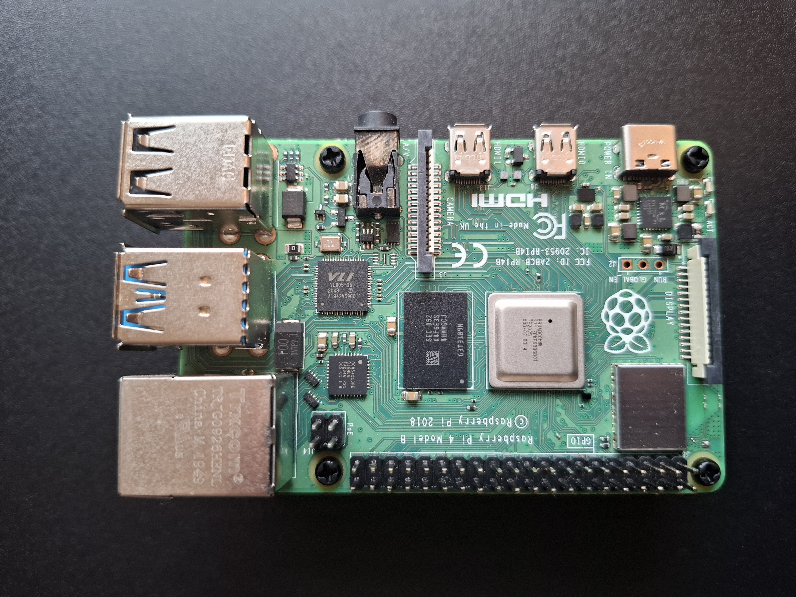
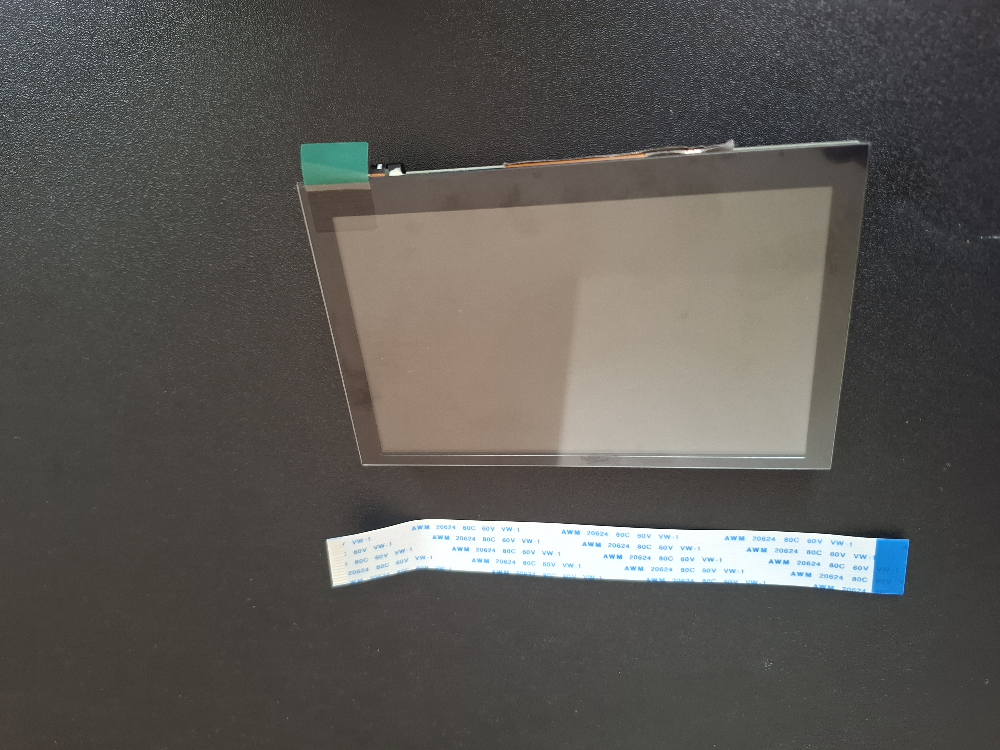
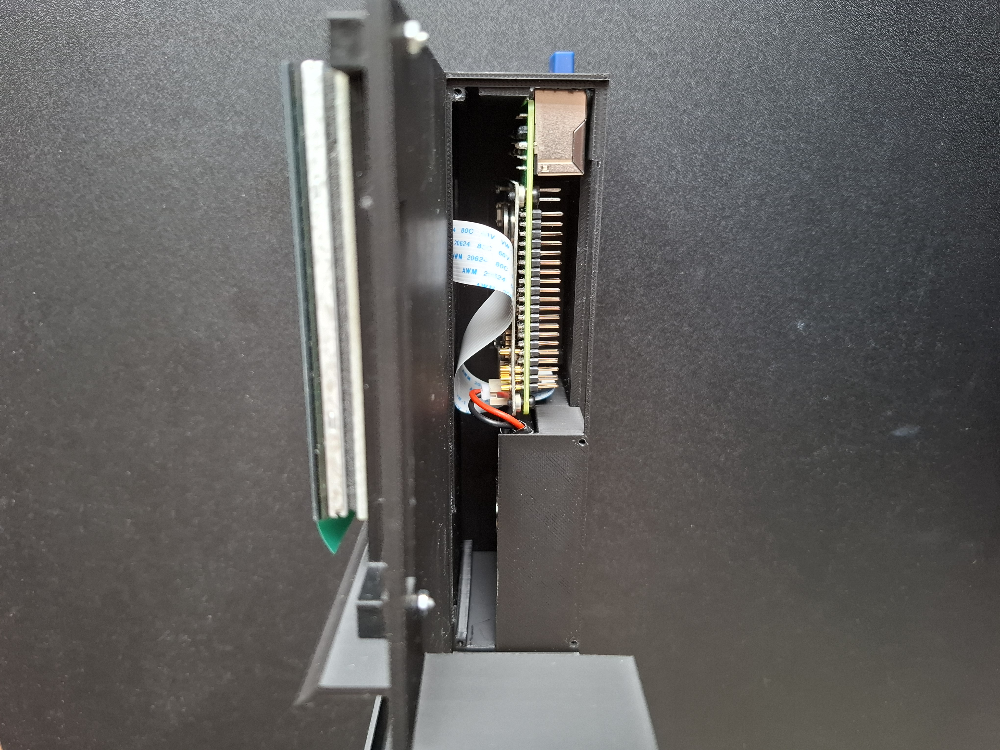
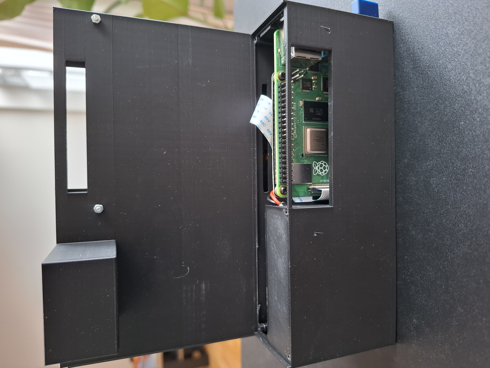
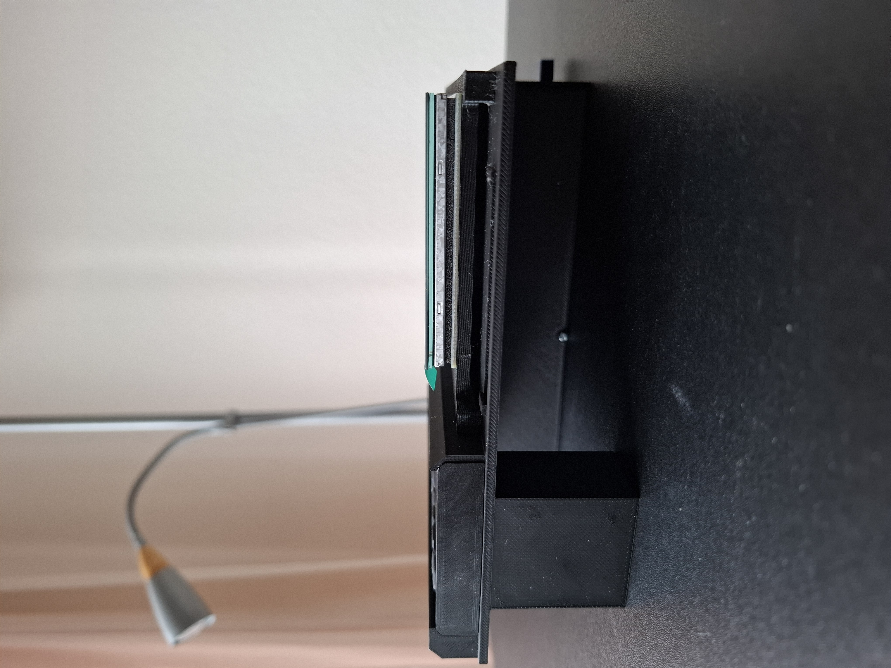
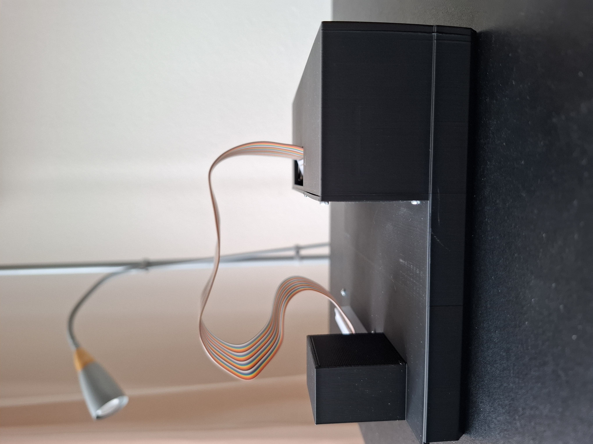
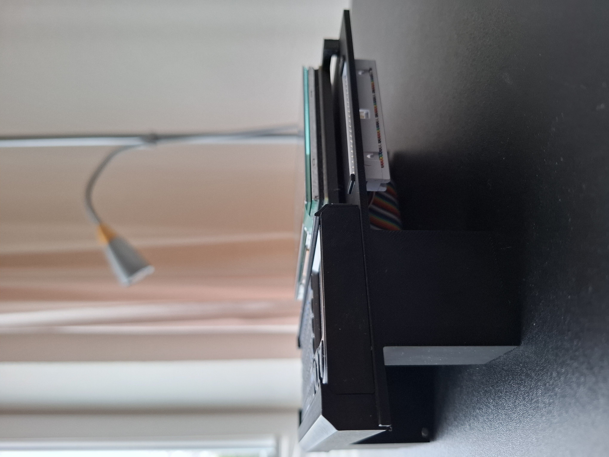
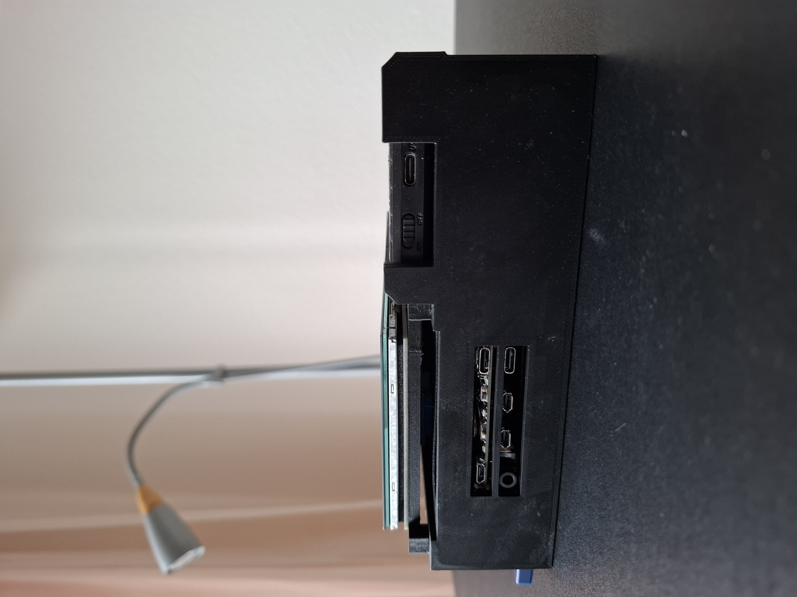
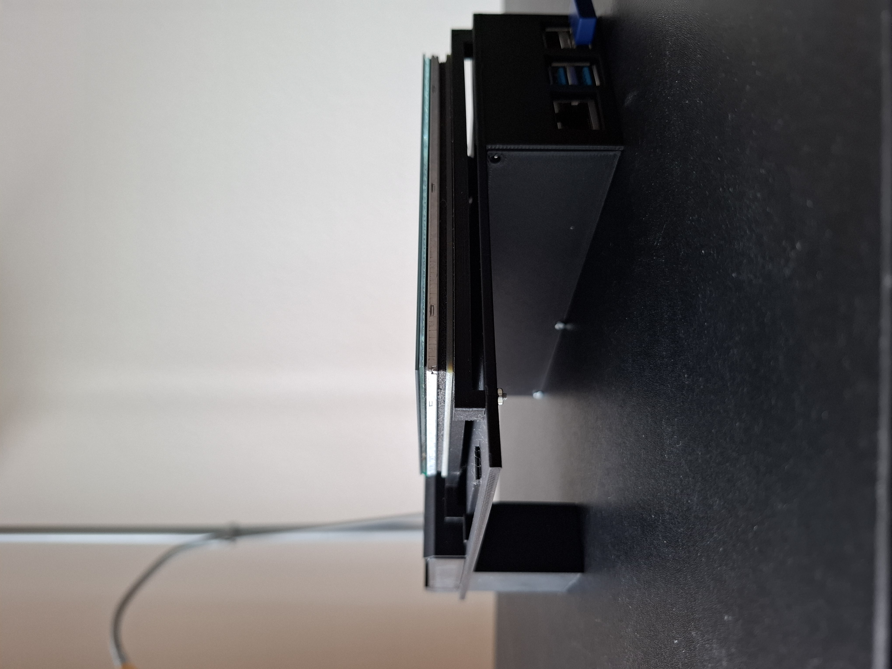

 

A cyberdeck is a custom-built, portable computer, often combining a single-board computer (e.g., a Raspberry Pi), display, keyboard, battery, and peripherals (e.g., camera, speakers) into a single, purpose-driven unit.
Cyberdecks are often inspired by cyberpunk aesthetics.

In this project, I will be creating my first version of a cyberdeck. This first version will not particularly be a complex one since its the first one. The aim here is "Be as simple as possible".

Since my first priority is simplicity, I will be skipping anything that require soldering, unless its absolutely necessary. I will be also settling for a straight forward case with an attempt to make it look cyberpunky.

---

## Materials

Materials used in this project:

- Raspberry Pi 4B
- Battery with a 5v/3A output
- 5 inch display
- Keyboard
- Case: was 3D printed

---
### Raspberry Pi

This is a Raspberry Pi 4B with 2GB LPDDR4 RAM, supports WiFi and Bluetooth, Gigabit Ethernet, two USB 3.0 and two USB 2.0 ports. It also contains dual micro HDMI and a USB-C power port and 40 pin GPIO header, which I will be relocating in this Cyberdeck (See Assembly).

{width="50%"}

### BatteryAssembly

Starting with the power supply, depending on which battery you choose, you will have different configurations. In my case, I chose the 5000 mAh PiSugar 2 plus battery.

::: {.columns}
::: {.column width="48%"}
{width=100%}
:::

::: {.column width="4%"}
<!-- empty column = gap -->
:::

::: {.column width="48%"}
{width=100%}
:::
:::

As seen in the pictures above, this battery allows me to connect the PCB board directly to the Pi itself from below, and to place the battery on the PCB board stabilizing it with magnets. However, I will be putting the battery itself next to the Raspberry Pi, rendering the magnets useless.

### Display

For the display, I am using the Waveshare 5-inch DSI touch screen with 800 x 480 resolution.

::: {.columns}
::: {.column width="48%"}
{width=100%}
:::

::: {.column width="4%"}
<!-- empty column = gap -->
:::

::: {.column width="48%"}
{width=100%}
:::
:::

### Keyboard

I used the Rii X1 Mini Wireless Keyboard with a Touchpad.

{width="50%"}

### Case: 3D Printed

Here you can find the STL files, feel free to use and modify them.

[Download STL files](https://github.com/PiVault/PiVault.github.io/tree/main/stl)

Obviously, as this is the first version and my first time doing such thing, the case is not the most fancy, it is a regular straight forward lame one with some flaws but it does the job!
More sophisticated versions will be created in the future.

## Assembly

### Pi & Battery

It is a bit narrow while assembling it but it works.
You have to connect everything outside and put all the parts in one go.

In the first picture below, you can see the battery wires are going to the left, there the battery will be sitting minding its own business.

For the Pi and the Pisugar PCB board, on the inner side (you cant see it here), there are two holes to screw it, stabilizing it in its place.

::: {.columns}
::: {.column width="48%"}
{width=100%}
:::

::: {.column width="4%"}
<!-- empty column = gap -->
:::

::: {.column width="48%"}
{width=100%}
:::
:::

In the picture on the right you can see the display serial interface ribbon cable (flat-flex cable/FFC) going through an opening to connect on the other side with the display.

### Keyboard & Display

Here as you can see the keyboard is inserted from the side and then secured by this small printed piece (see picture below on the left). A side view is shown in the picture below on the right of how this piece would look like.

The display it is mounted on a mount printed for it specifically, that is then mounted on the main deck with four screws as seen on the left picture.

::: {.columns}
::: {.column width="48%"}
{width=100%}
:::

::: {.column width="4%"}
<!-- empty column = gap -->
:::

::: {.column width="48%"}
{width=100%}
:::
:::

### GPIO pins

The purpose of the opening that you can see next to the sceen, is to relocate the GPIO pins to have access to them in a convienient way.
In the pictures you can see how it would look.

::: {.columns}
::: {.column width="48%"}
{width=100%}
:::

::: {.column width="4%"}
<!-- empty column = gap -->
:::

::: {.column width="48%"}
{width=100%}
:::
:::

## End Result

Below the end result is shown from all sides.

As you can see there is no buttons in this project, I just kept an opening for the Pisugar buttons.
The PiSugar PCB includes a power switch that controls whether current is supplied to the Pi. When the switch is turned ON, it allows current to flow and powers the Pi.

Additionally, there is a configurable button on the PCB. I have set it so that a double-click shuts down the Pi.

::: {.columns}
::: {.column width="48%"}
{width=100%}
:::

::: {.column width="4%"}
<!-- empty column = gap -->
:::

::: {.column width="48%"}
{width=100%}
:::
:::

Pushing these buttons with your finger can be annoying, so using a screw driver like the one shown in the picture or any pen works fine.

::: {.columns}
::: {.column width="48%"}
{width=100%}
:::

::: {.column width="4%"}
<!-- empty column = gap -->
:::

::: {.column width="48%"}
{width=100%}
:::
:::

## Limitations & Future Fixes

- The 3D printed case need to be improved to have a better design, especially the part that holds the keyboard, it is not the most secure one.
- Buttons need to be added, using a screw driver or a pen is not ideal.
- The Raspberry Pi 4B with only 2 GB of RAM is quite slow, upgrading to a newer model is always a good idea.
